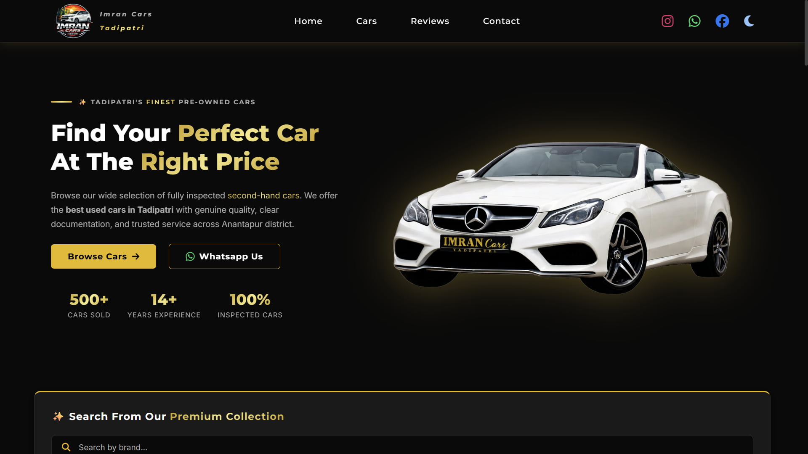

# 🚗 Imran Cars Tadipatri – Pre-Owned Cars Website

A modern, responsive website built for a real-world second-hand car business.
This project focuses on clean UI, real-time filtering, and a smooth user experience.

---

## 🔗 Live Demo

👉 [View Live Website](https://imran-cars-tadipatri.vercel.app/)

---

## 📌 About the Project

This website was developed for my brother’s car business to showcase available pre-owned vehicles online.

This project uses real business data and simulates a production-level car listing platform.

Car data is managed using a JSON file and dynamically rendered on the website using JavaScript.

---

## 🚀 Features

* 🔍 Real-time car search functionality
* 🎯 Advanced filters (budget, brand, fuel, KM, transmission, etc.)
* 🚗 Dynamic car listings using JSON data
* 🪟 Interactive car detail modal with image carousel
* 🎞 Swiper.js integration for reviews and modal slider
* ✨ Scroll reveal animations using Intersection Observer
* 📨 Web Share API — share any car listing directly to WhatsApp or any app
* 🌗 Dark/Light theme toggle
* 📱 Fully responsive (mobile-first design)
* ⭐ Customer reviews section
* ❓ FAQ section
* 📞 Contact & location section with Google Maps
*  👀 SEO optimised + Google Search Console + Google Analytics

---

## 🛠 Tech Stack

* HTML5
* CSS3
* JavaScript (Vanilla JS)
* Swiper.js

---

## 📂 Project Structure

```
index.html
css/
  style.css
  navbar.css
  hero.css
  cars.css
  modal.css
  sections.css
  footer.css
js/
  main.js
  filter.js
  modal.js
data/
  cars.json
images/
  assets/
  cars/
```
---

## 🧠 Key Concepts Used

* DOM Manipulation
* Event Handling
* Dynamic Rendering (JSON → UI)
* Intersection Observer API
* State-based UI (filters & theme toggle)

---

## 📸 Preview



---

## 🎯 Purpose

The goal of this project is to:

* Build a real-world business website
* Improve frontend development skills
* Focus on UI/UX and responsiveness
* Practice working with dynamic data

---

## 👨‍💻 Developer

**Yellutla Sabeena** — Frontend Developer  
Built with zero templates, zero Bootstrap, zero shortcuts.

---

## 📬 Feedback

Feel free to share your feedback or suggestions to improve this project!
